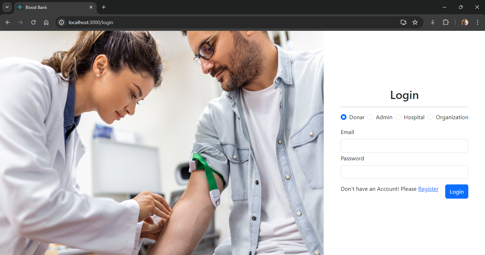
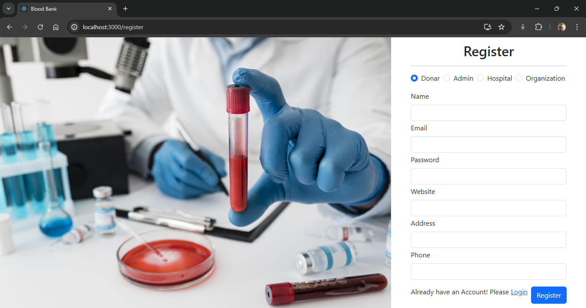
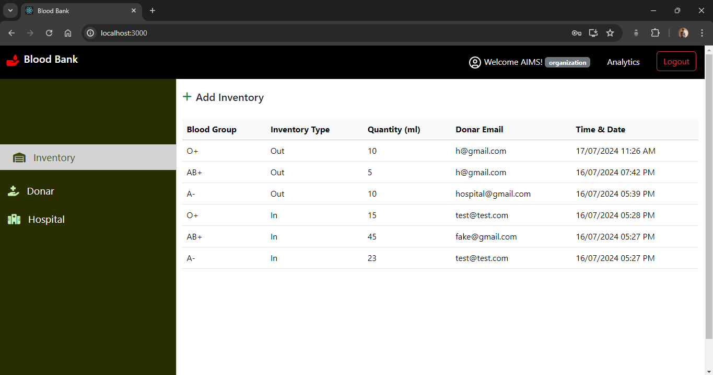
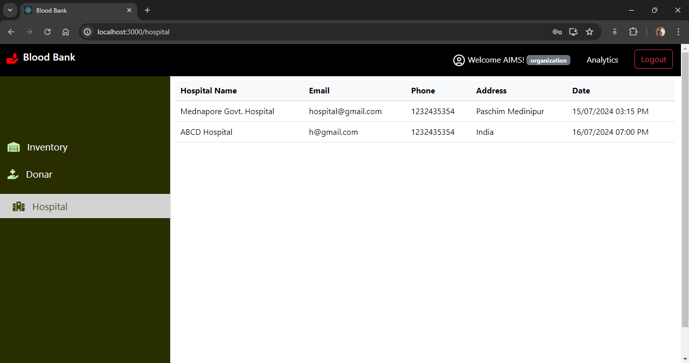
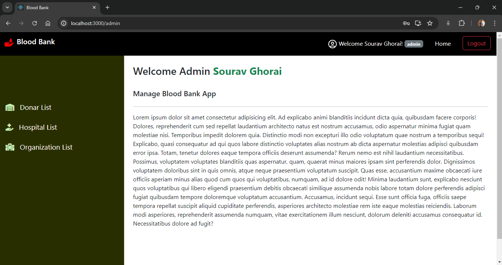
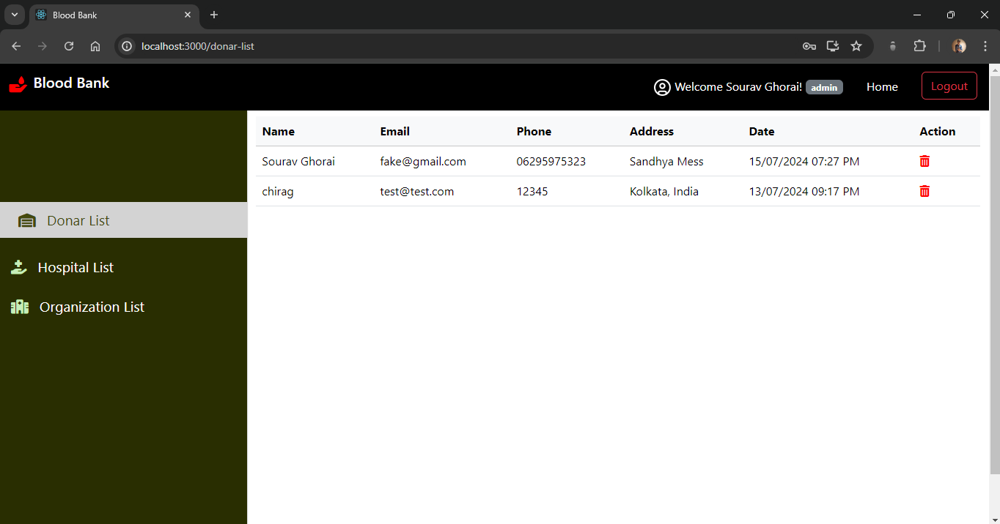
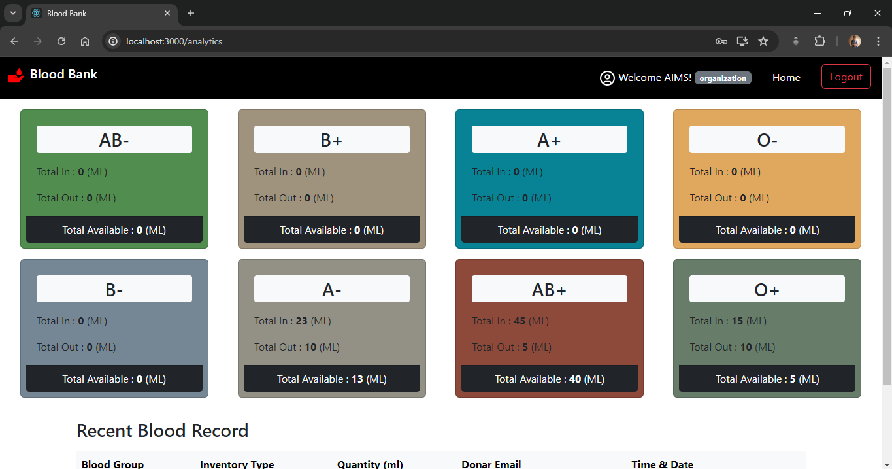

# 🩸 **BloodBank**

BloodBank is a full-stack application built using the MERN stack (MongoDB, Express.js, React, Node.js). It streamlines the blood donation process by providing an easy-to-use platform for managing blood donations, donor information, and user roles.
<!-- ### The site is currently running at [https://perfect-pear-yoke.cyclic.app/](https://perfect-pear-yoke.cyclic.app/) -->

## 📸 Some Clips

#### Register & Login <br/>

  <br/>

#### Other Pages <br/>

   <br/>



## ✨ Features

- 🔒 User authentication and authorization
- 📊 Dashboard for admin, organization, and hospital users
- 👥 Depending on the role (admin, organization, hospital, donor), access different functionalities.
- 🗄️ Manage donor and inventory records
- 👤 Admins can manage all data, organizations can manage their own donors, and hospitals can view available blood inventory.

## 🛠️ Technologies Used

- **Frontend**: React, Redux Toolkit, React Router, React Toastify
- **Backend**: Node.js, Express.js
- **Database**: MongoDB
- **Other**: JWT for authentication, bcrypt for password hashing

## 🏁 Getting Started

These instructions will get you a copy of the project up and running on your local machine for development and testing purposes.

### 📋 Prerequisites

Before you begin, ensure you have met the following requirements:

- 🖥️ You have a recent version of **Node.js** installed. If not, you can download it from [here](https://nodejs.org/)
- 🧰 You have a package manager like **npm** (comes with Node.js) or **yarn** installed.
- 🛠️ You have **Git** installed. If not, you can download it from [here](https://git-scm.com/downloads)

## 🛠️ Installation & Set Up

1. 🔽 Clone the repository:

   ```bash
   git clone https://github.com/Sourav-Ghorai/BloodBank.git
   ```

2. 📂 Navigate to the project directory:

   ```bash
   cd BloodBank
   ```

3. 🌐 Install dependencies for both client and server:

   ```bash
   npm install
   cd client
   npm install
   ```

4. 🌿 Create a .env file in the root directory and configure environment variables such as MongoDB URI, JWT secret etc.

   ```bash
   cp .env.example .env
   ```

   Open `.env` and replace the placeholders with your actual data.

## 🚀 Running the Application

After installing the dependencies, you can run the application using the following scripts defined in the `package.json` file:

- To run the application in development mode, use:
  ```bash
  cd ../client
   npm start

  cd ..
   npm start

  ```

Access the Application:

Open your browser and navigate to http://localhost:3000 to access the BloodBank application.

## Contribution

Contributions are welcome! If you'd like to contribute to BloodBank, feel free to fork the repository, make your changes, and submit a pull request. Make sure to follow the project's coding guidelines and conventions.

**Thank you for choosing BloodBank! Enjoy our service! 🙂**
